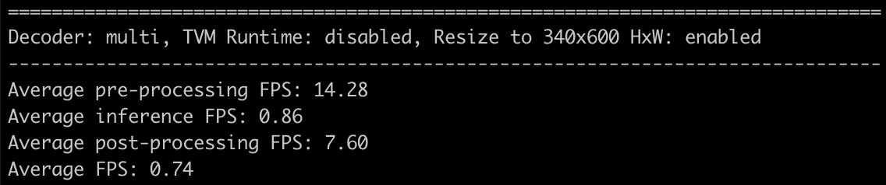

# Speeding up body pose estimation on CPU with TVM

## Setup

### Optimizing the model on CPU

```bash
docker-compose build
docker-compose --compatibility run posenet-cpu python3 image_demo.py --decode single --resize --use-tvm --verbose
```

See [`image_demo.py`](./image_demo.py) and [`video_demo.py`](./video_demo.py) for more options.

### Development

After [installing Poetry](https://python-poetry.org/docs/#installation) (used for package versioning and dependency tracking), you can install the dependencies by running

```bash
poetry install
```

## Model overview


The model is adapted from the [PyTorch port](https://github.com/rwightman/posenet-pytorch) of the Google [TensorFlow.js PoseNet model](https://github.com/tensorflow/tfjs-models/tree/master/posenet), which is itself based on two papers:

- [Towards Accurate Multi-person Pose Estimation in the Wild](https://arxiv.org/abs/1701.01779)
- [PersonLab: Person Pose Estimation and Instance Segmentation with a Bottom-Up, Part-Based, Geometric Embedding Model](https://arxiv.org/abs/1803.08225)

You can read more about the details of the architecture that makes it work well on mobile devices in the [post from the team](https://medium.com/tensorflow/real-time-human-pose-estimation-in-the-browser-with-tensorflow-js-7dd0bc881cd5).

The model runs both in single-pose and multi-pose settings: the backbone is the same, the difference is only in the post-processing.

## TVM in a nutshell

### How do deep compilers work?

The following overview from [1] summarizes the design of a deep learning compiler:


Most deep learning compilers (including TVM) contain two primary parts: the frontend and backend -- which munge and optimize the intermediate representation.

a. The **frontend** converts a model from common deep learning frameworks like PyTorch and TensorFlow into the high-level graph representation that abstracts the computation and control flow with the goal of providing an interface for graph-level optimizations. The graph (both a DAG and a let-binding in the case of TVM) contains rich semantic information, offering extensibility for customized operators. The computation in TVM is represented in terms of _tensor expressions_, which combine lambda expressions of computational rules together with the knowledge of the shape of the output tensor.

b. The **backend** is designed for translation of the high-level IR into the low-level IR that allows hardware-specific optimizations together with code generation on diverse hardware targets. TVM uses auto-tuning in order to determine the optimal parameter setting in the large optimization space.

### How is TVM different from [MLIR](https://mlir.llvm.org/)?

MLIR is a compiler infrastructure on par of LLVM that sits between the model representation and code generation. In the long term, it will allow developers to utilize the optimizations available in different frameworks for deep learning compilation. MLIR and TVM have complementary goals.

## Benchmarks

On a single GPU, a model based on the popular [OpenPose](https://github.com/CMU-Perceptual-Computing-Lab/openpose) processes **6.87** FPS on a single GPU and **0.17** FPS on an 8-core CPU. After TVM optimizations, PoseNet offers **4.71 FPS** on a **single-core CPU** and **16.11 FPS** on 8 cores, while also leaving lower memory footprint.

The benchmarks below show inference times on Intel(R) Core(TM) i7-7820X CPUs @ 3.60GHz and a single NVIDIA GeForce GTX 1080 Ti GPU.

### Multi-pose

#### Inference on a single-core CPU with and without TVM

<p align="center" width="100%">
     
     
</p>

### Single-pose

#### Inference on a single-core CPU with and without TVM

<p align="center" width="100%">
     
     
</p>

#### Inference on 8 cores of CPU vs inference on a single GPU, both with TVM

<p align="center" width="100%">
     
     
</p>

## References & further reading

[1.] [A comprehensive comparison of deep learning compilers (2020)](https://arxiv.org/abs/2002.03794)

[2.] [A dive into TVM via Jupyter Notebooks (WIP)](http://tvm.d2l.ai/)
